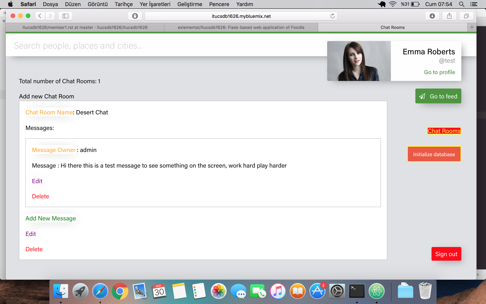
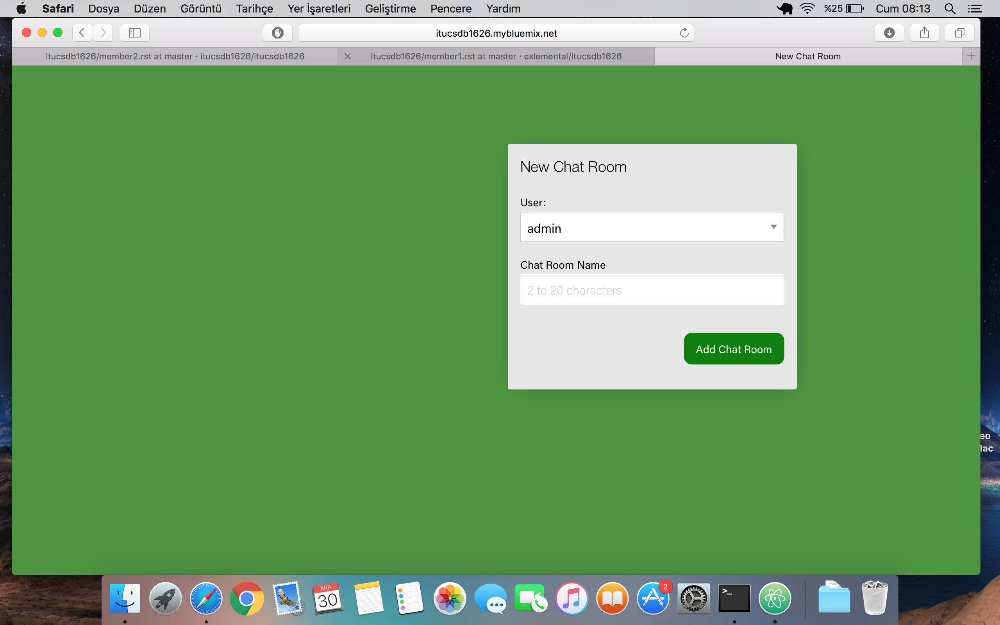
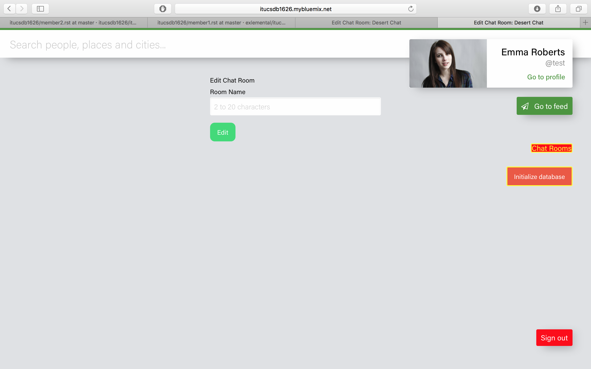
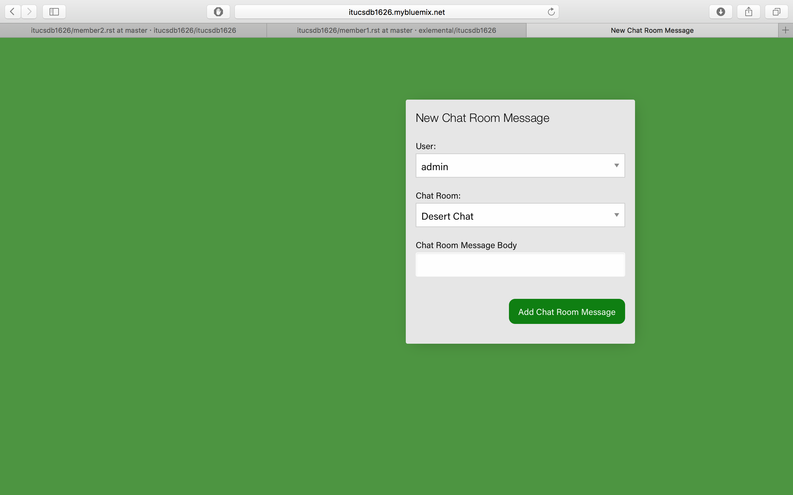

Parts Implemented by Kerem ER
================================

User guide for implemented features chat room and messages that can be posted inside these rooms.

Implemented 2 features with their entities as follows:

Features
********

1. `Chat Rooms`_
2. `Chat Room Messages`_

Chat Rooms
**********

Index Page
----------

    ** Chat Rooms Index Page**

* Add New Chat Room: This link is for adding new chat room into existing chat rooms.

* Chat Room Name: This is the link for index page of chat rooms.

* First 'Edit' button inside chat room message is for editing the existing chat room message.

* First 'Delete' button inside chat room message is for deleting corresponding chat room message.

* 'Add New Message' button is for adding new chat room message into this chat room.

* Second 'Edit' button is for editing this chat room.

* Second 'Delete' button is for deleting this chat room.

Add New Chat Room Page
----------------------

    **New Chat Room Page**

* In User section of dropdown structure we can select the user who is creating this new chat room.

* In Chat Room Name selection of dropdown structure we can type the name of the new chat room.

Edit Chat Room Page
-------------------

* We can type a new room name to update existing room name into the Room Name box in that page.

* 'Edit' button in here is for confirming changes.

Chat Room Messages
******************

Index Page
----------

    .. figure:: member4images/chat_room_messages_index.png
        :scale: 75 %
        :alt: place_ratings_index_page
        :align: center

        **Index Page**

*  Message owner link goes to show page of that message.
* 'Add New Message' Button goes to new chat room message page.
* 'Delete' buttons exists in each message deletes corresponding chat room message.
* 'Edit' buttons exists in each message goes to edit page of corresponding chat room message.
* 'Go To Chat Room' buttons exists in each message goes to corresponding chat room which that message exists in.

Show Page
---------

    .. figure:: member4images/show_page_chat_room_messages.png
        :scale: 75 %
        :alt: place_ratings_show_page
        :align: center

        **Show Page**

* Message shown in that page.
* Same buttons exits in that page has the same features 'Go To Chat Room' , Edit and Delete.

Add New Message Page
--------------------

    **Add New Message page**

* In User section of dropdown structure we can select the user who is adding this new chat room message.

* In Chat Room selection of dropdown structure we can select which chat room we want to send our message.

* Chat Room Message Body is for typing the message that we want to post into the chatroom we selected.
